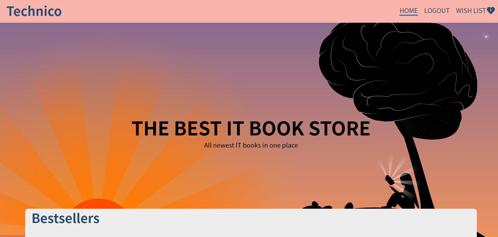

# Book-store

A book store app generated with Angular and Firebase for data storage. Book data provided by the [IT Book store API](https://api.itbook.store/).

## Functionalities

- **all bestselling books are displayed for the user**
- **the user can add books to a wishlist**
- **the user can remove books from a wishlist**
- **the user must login/signup to view the wishlist**

## Would you like to try it out

- **Clone the repo: https://github.com/Danijela2019/book-store.git**
- **Run this command in the terminal to install packages: 'npm install'**
- **Next run this command in your terminal 'ng serve --open'**
- **View the application in the browser(http://localhost:4200)**
